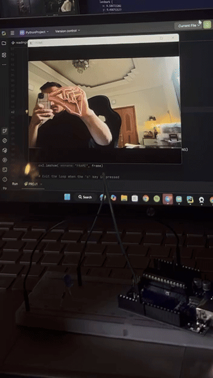

# Gesture-Controlled LED

A real-time gesture-LED-control project using **MediaPipe**, **OpenCV**, and **Arduino**.

## How IT Works

-Detects hand gestures

-Sends signal to Arduino 

-Turns LED on/off based on finger gestures

