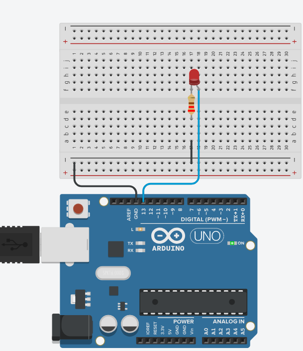

# Gesture-Controlled LED
A real-time gesture-LED-control project using **MediaPipe**, **OpenCV**, and **Arduino**.

## Software 💻
- Python
  - OpenCV (library)
  - MediaPipe (library)
  - Math (library)
- Arduino IDE
  - PyFirmata sketch / Serial Communication

  ## Hardware ⚙️
  -  Arduino UNO
  -  Breadboard
  -  Wires (for connection)
  -  Led
  -  Resistor (220 Ohm)
  -  webcam or Phone

    

## 🖼️ Circuit diagram

## How IT Works
-Detects hand gestures using MediaPipe
-Sends signal to Arduino via Python
-Turns LED on/off based on finger gestures

